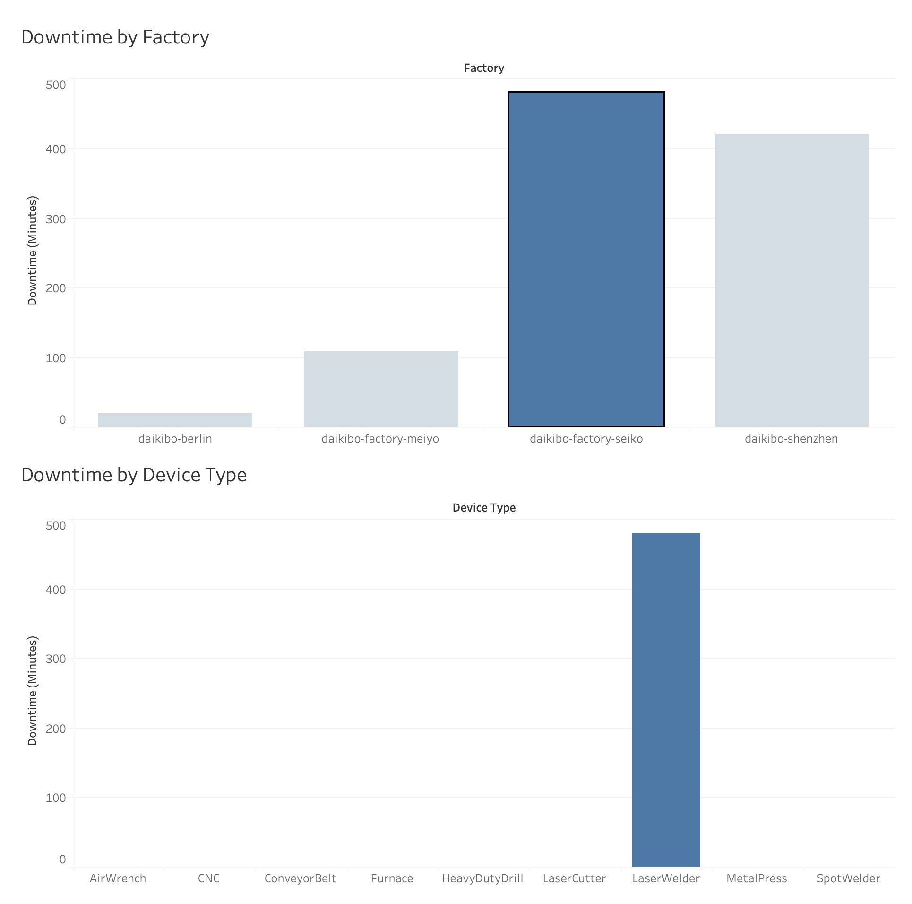
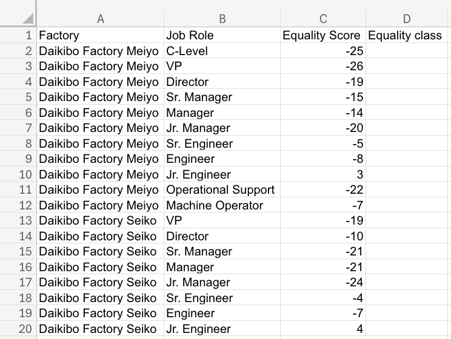
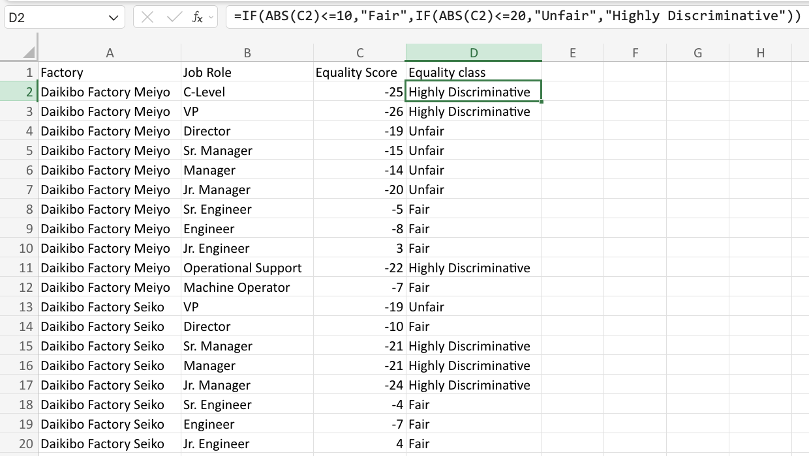

# Deloitte Australia Data Analytics Job Simulation

**Platform:** Forage  
**Tools:** Tableau, Microsoft Excel  
**Completed:** August 2026

## Project Overview

I completed Deloitte Australia's Data Analytics Job Simulation through Forage. The simulation involved analyzing manufacturing telemetry data and employee compensation data to answer business questions and communicate findings.

## Task 1: Manufacturing Telemetry Analysis

### Business Question

The client collected telemetry data from machines across four factories and wanted to understand:

- Which factory experienced the most machine downtime?
- Which device types contributed the most downtime at that location?

### What I Did

I imported the provided telemetry data into Tableau and created a calculated field to measure machine downtime. I then created two visualizations:

- Downtime by factory
- Downtime by device type

I combined the visualizations into an interactive dashboard that allowed the factory results to filter the device-level analysis.

### Key Finding

The analysis showed that **Daikibo Factory Seiko** experienced the most downtime. After filtering the dashboard to that factory, **LaserWelder** showed the highest downtime among the device types.

### Tableau Dashboard

## Task 2: Pay Equality Analysis

### Business Question

The second task involved analyzing employee compensation data to help identify potential pay equality concerns across different factories and job roles.

### What I Did

Using Excel, I analyzed the provided equality scores and created a new **Equality Class** column. I used a nested `IF` formula with the `ABS` function to automatically classify each score based on its distance from zero.

The classifications included:

- **Fair:** scores between -10 and 10
- **Unfair:** scores between -20 and -11 or 11 and 20
- **Highly Discriminative:** scores below -20 or above 20

### Excel Formula

`=IF(ABS(C2)<=10,"Fair",IF(ABS(C2)<=20,"Unfair","Highly Discriminative"))`

### Before Classification

### After Classification

## Skills Demonstrated

- Data Analysis
- Data Visualization
- Tableau
- Microsoft Excel
- Dashboard Development
- Calculated Fields
- Excel IF Functions
- Data Classification
- Business Problem Solving

## Certificate

[View Deloitte Australia Data Analytics Job Simulation Certificate](deloitte-data-analytics-certificate.pdf)
