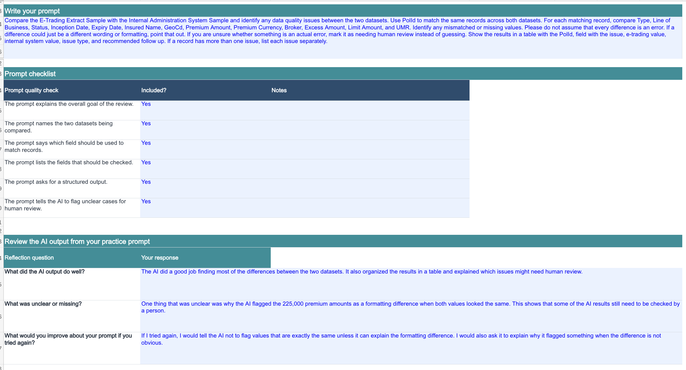
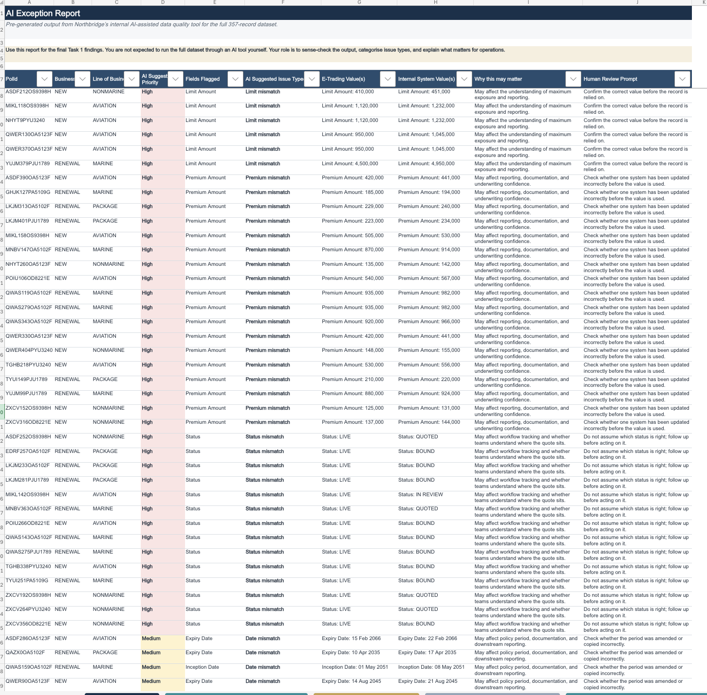
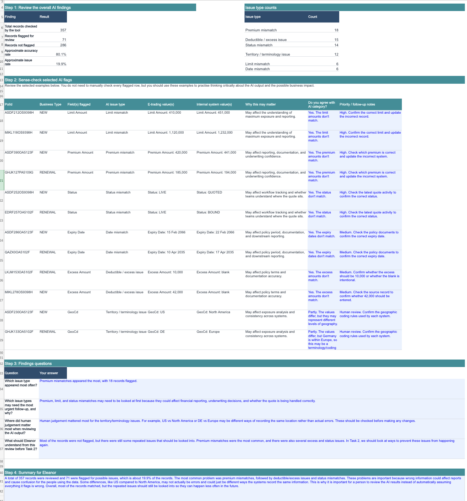

# London Insurance Life Operations Analyst Job Simulation

## Project Overview

I completed the London Insurance Life Operations Analyst Job Simulation on Forage. In this simulation, I worked with fictional insurance data to review data quality issues between an e-trading platform and an internal administration system.

The project focused on using Excel and AI-assisted tools to find possible data issues, review the AI results, and think about ways the business could prevent similar problems in the future.

## Tools Used

- Microsoft Excel
- AI-assisted data review
- SWOT analysis

## What I Did

### 1. Created an AI Prompt

I was given sample data from an e-trading system and an internal administration system. I created a prompt asking AI to compare matching records using the Policy ID and check fields such as:

- Premium amount
- Status
- Deductible / excess
- Territory
- Limit amount
- Inception and expiry dates

I also instructed the AI not to automatically assume every difference was an error and to flag unclear cases for human review.

### 2. Reviewed the AI Exception Report

I reviewed a pre-generated AI-assisted exception report covering **357 records**.

The report flagged **71 records** for possible issues, which was approximately **19.9%** of the records reviewed. The other **286 records (80.1%)** were not flagged.

The issues identified included:

| Issue Type | Records Flagged |
|---|---:|
| Premium mismatch | 18 |
| Deductible / excess issue | 15 |
| Status mismatch | 14 |
| Territory / terminology issue | 12 |
| Limit mismatch | 6 |
| Date mismatch | 6 |

### 3. Sense-Checked the AI Results

Instead of automatically accepting the AI results, I reviewed selected flags and compared the e-trading values with the internal system values.

I looked at whether the issue category made sense, why the difference could matter to the business, and what should happen next.

This was especially important for territory differences. For example, values such as **US vs. North America** may represent different ways of categorizing a location instead of an actual data error. These cases would need human review before making a change.

### 4. Summarized the Findings

Premium mismatches were the most common issue, followed by deductible / excess issues and status mismatches.

Some differences could affect financial reporting, underwriting information, documentation, or workflow tracking. However, the review also showed why AI results should be checked by a person instead of assuming every flagged difference is incorrect.

### 5. Recommended a Process Improvement

In the second part of the simulation, I reviewed different ways Northbridge could reduce future data quality issues.

The options included:

- Targeted internal checks
- Third-party support
- Technology-led improvements

I recommended a phased approach. In the short term, the company could focus manual checks on higher-risk fields. Over time, validation rules, automated exception reporting, and better system integration could help prevent recurring issues while still keeping human review for unclear or higher-risk cases.

## Skills Practiced

- Excel data analysis
- Data quality management
- Data reconciliation
- Data analysis
- Attention to detail
- AI-assisted analysis
- Process analysis
- SWOT analysis
- Business communication
- Stakeholder awareness

## Key Takeaway

This project helped me understand that finding a difference in data does not always mean there is an error. AI can make it easier to find possible issues across many records, but human review is still important for understanding the context and deciding what action should be taken.

## Certificate

I completed the **London Insurance Life Operations Analyst Job Simulation on Forage** on September 25, 2026.

[View Certificate](Certificate/Forage%20Operations%20Analyst%20Simulation%20Certificate.pdf)
