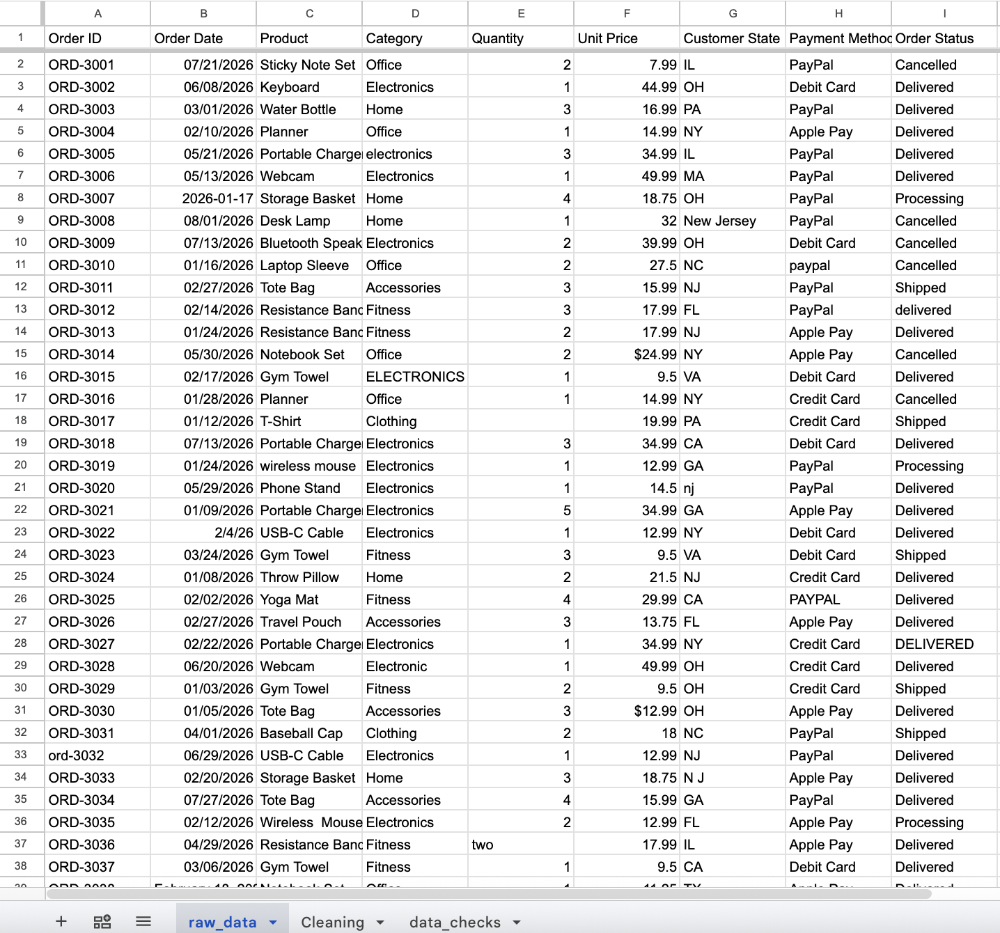
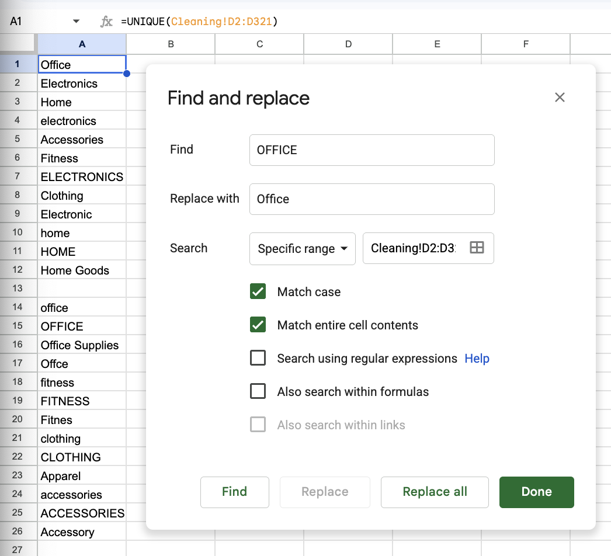
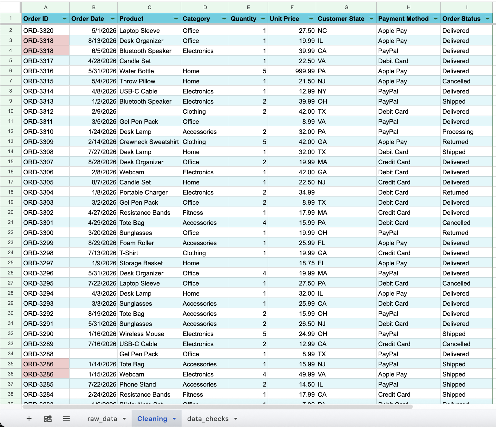
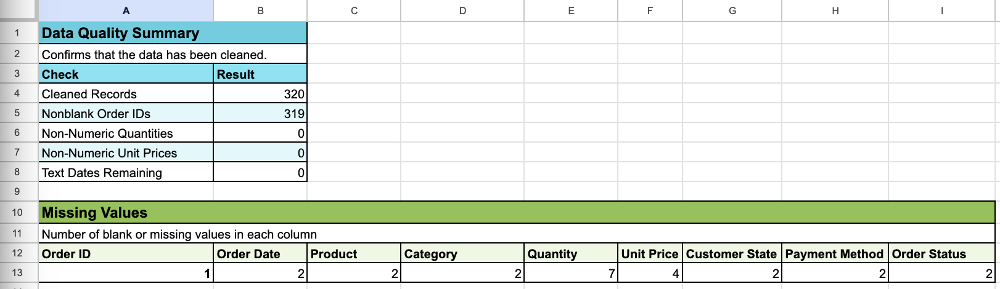
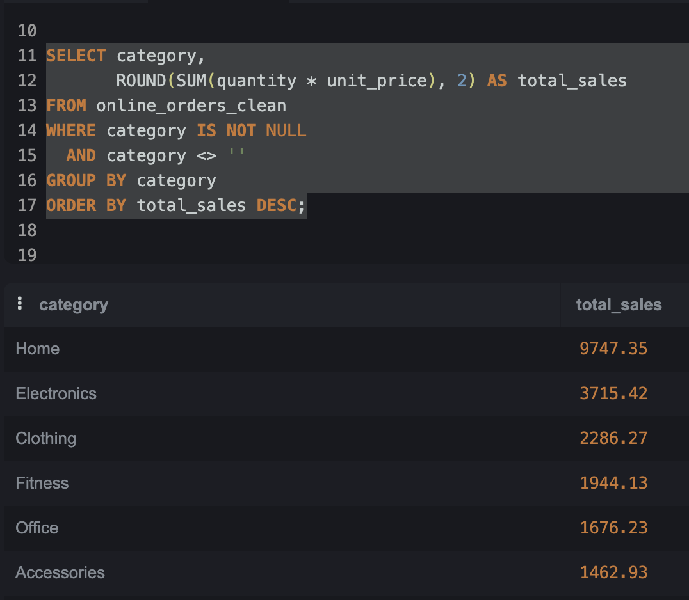
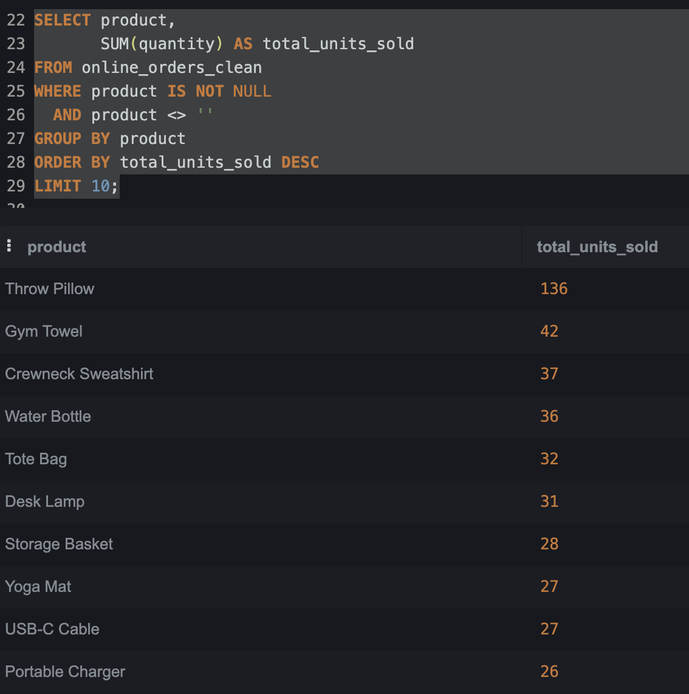

# Online Shopping Orders Analysis

## Project Overview

This project analyzes a dataset of online shopping orders. I used Google Sheets to clean and organize the data, then used SQL to explore the cleaned dataset and answer basic questions about sales, products, customer states, and order statuses.

The goal of this project was to practice the data analytics process, including data cleaning, checking data quality, working with missing values, and using SQL to find useful information from the data.

## Tools Used

- Google Sheets – data cleaning and data quality checks
- SQL (SQLite) – data analysis
- GitHub – project documentation

## Data Cleaning

I cleaned the dataset in Google Sheets before analyzing it with SQL. I kept a copy of the original data so I could compare it with the cleaned version.

### Before Cleaning

The original dataset contained inconsistent formatting, duplicate rows, missing values, and values that needed to be reviewed.

Some of the cleaning steps included:

- Removed 8 duplicate rows, leaving 320 records.
- Standardized product names, categories, customer states, payment methods, and order statuses.
- Fixed inconsistent date formats.
- Converted quantity values such as "two" and "five" into numbers.
- Fixed inconsistent unit price formats and left invalid or unknown values blank.
- Standardized Order ID formatting.
- Checked for missing values and left them blank when the correct value could not be determined.
- Identified duplicate Order IDs and kept the records when the rest of the order information was different.
- Kept possible outliers when there was not enough information to determine that they were errors.

### Cleaning Process

I used Google Sheets functions and tools to review and standardize the data. For example, I used the UNIQUE function to identify inconsistent category values and Find and Replace to standardize them.

### Cleaned Data

After cleaning, I reviewed the dataset again and performed data quality checks before moving on to SQL.

### Data Quality Checks

I checked the cleaned dataset for missing values, non-numeric quantities and prices, and dates that were still stored as text. These checks helped confirm that the data was ready for analysis while also documenting the missing values that remained.

## SQL Analysis

After cleaning the data, I imported the cleaned dataset into SQLite and used basic SQL queries to explore the data.

I used SQL to:

- Preview the cleaned dataset and confirm the data imported correctly.
- Count the total number of order records.
- Calculate total sales by product category.
- Find the products with the highest quantity sold.
- Calculate total sales by customer state.
- Count orders by order status.

The analysis gave me practice using SELECT, COUNT, SUM, WHERE, GROUP BY, ORDER BY, and LIMIT.

### Sales by Product Category

I used SUM and GROUP BY to calculate sales for each product category.

### Top Products by Quantity Sold

I grouped the data by product and calculated the total quantity sold to find the products with the highest quantities.

## Key Findings

- The cleaned dataset contains 320 order records.
- Home had the highest calculated sales among the known product categories, with $9,747.35 in sales.
- Throw Pillow had the highest total quantity sold with 136 units. This result was affected by a large quantity value that was kept in the dataset because there was not enough information to confirm it was an error.
- Pennsylvania had the highest calculated sales by customer state, with $6,553.29.
- Delivered was the most common order status with 192 records, followed by Shipped with 42.
- Two records had missing order statuses, so the order status analysis included 318 of the 320 records.

## Project Files

- [`Data/Raw/online_orders_raw.csv`](Data/Raw/online_orders_raw.csv) – Original dataset before cleaning.
- [`Data/Cleaned/online_orders_clean.csv`](Data/Cleaned/online_orders_clean.csv) – Cleaned dataset used for the SQL analysis.
- [`SQL/online_orders_analysis.sql`](SQL/online_orders_analysis.sql) – SQL queries used to analyze the cleaned data.
- [`Images/`](Images/) – Screenshots from the data cleaning and analysis process.

## What I Learned

This project helped me get more comfortable working through a dataset from start to finish. I practiced cleaning messy data in Google Sheets, checking my work, and deciding how to handle missing values and possible outliers without making assumptions.

I also got more practice using basic SQL to answer questions from the cleaned data. One thing I learned was how important data cleaning is before analysis because inconsistent values, missing data, and outliers can affect the results.
