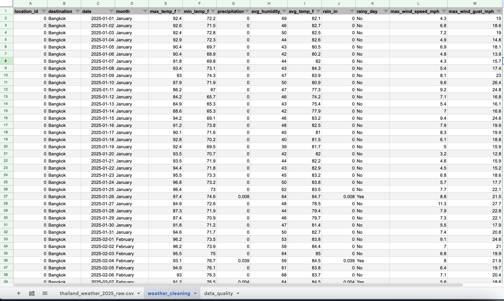
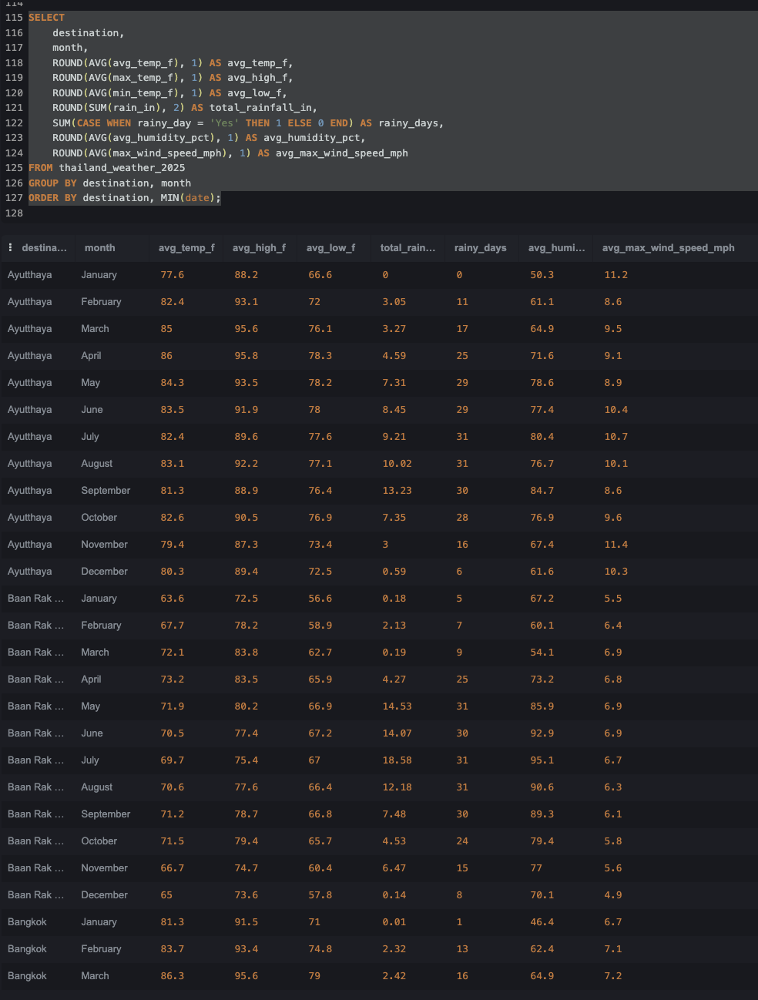
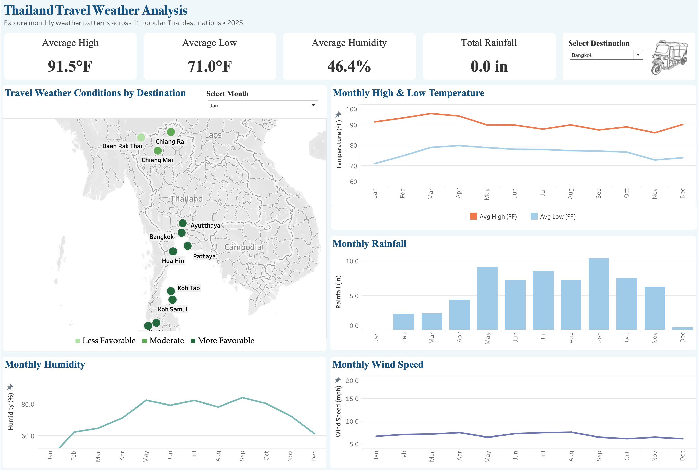

# Thailand Travel Weather Analysis

## Project Overview

I created this project to practice the full data analysis process using a topic I was personally interested in: traveling to Thailand.

The goal of this project was to explore weather patterns across popular destinations in Thailand and see how conditions changed throughout 2025. I focused on temperature, rainfall, rainy days, humidity, and wind speed.

I started with daily weather data, cleaned and organized it in Google Sheets, analyzed it using SQL, and then created an interactive dashboard in Tableau.

## Tools Used

- **Google Sheets** - data cleaning and organization
- **SQL (SQLite)** - data analysis and creating monthly summaries
- **Tableau** - data visualization and dashboard creation

## Dataset

The weather data came from Open-Meteo historical weather data.

The dataset includes daily weather information from January through December 2025 for 11 destinations in Thailand:

- Bangkok
- Chiang Mai
- Chiang Rai
- Baan Rak Thai
- Phuket
- Krabi
- Koh Samui
- Koh Tao
- Pattaya
- Hua Hin
- Ayutthaya

The weather data includes temperature, rainfall, humidity, and wind speed.

## Data Cleaning

I first cleaned and organized the daily weather data in Google Sheets.

Some of the cleaning steps included:

- Added destination names to the location IDs
- Renamed columns to make them easier to understand
- Added a month column
- Checked for duplicate rows
- Checked for missing values
- Created a rainy day column based on whether rain was recorded
- Checked that the dates and destination names were organized correctly

After cleaning, the dataset contained **4,015 daily weather records**.

## SQL Analysis

After cleaning the data, I imported it into SQLite and used SQL to explore the weather patterns.

I used SQL to calculate:

- Average temperature
- Average high and low temperatures
- Total rainfall
- Number of rainy days
- Average humidity
- Average maximum wind speed

I also grouped the daily data by destination and month. This created a monthly weather summary that was easier to use when building the Tableau dashboard.

Some of the SQL skills I practiced in this project were:

- `SELECT`
- `AVG()`
- `SUM()`
- `ROUND()`
- `CASE WHEN`
- `GROUP BY`
- `ORDER BY`

The full SQL analysis can be found in [`SQL/thailand_weather_analysis.sql`](SQL/thailand_weather_analysis.sql).

## Tableau Dashboard

After completing the SQL analysis, I used the monthly weather summary to create an interactive Tableau dashboard.

The dashboard lets the user select a destination and explore its weather patterns throughout the year. A month can also be selected to compare travel weather conditions across the different destinations on the map.

The dashboard includes:

- Average high temperature
- Average low temperature
- Average humidity
- Total rainfall
- Monthly high and low temperatures
- Monthly rainfall
- Monthly humidity
- Monthly wind speed
- A map comparing weather conditions across destinations

## Travel Weather Categories

For the map, I created a calculated field in Tableau to make the weather conditions easier to compare between destinations.

I used average temperature and the number of rainy days to separate the destinations into three categories:

- **More Favorable** - average temperature between 70°F and 85°F with 15 or fewer rainy days
- **Moderate** - average temperature between 65°F and 86°F with 25 or fewer rainy days
- **Less Favorable** - conditions outside of those ranges

These categories are only meant to provide a simple comparison for this project. They are not official travel ratings because what someone considers good weather can depend on their personal preferences.

## What I Learned

This project gave me experience working through multiple parts of the data analysis process instead of only creating charts.

I practiced cleaning and checking a raw dataset, using SQL to summarize thousands of daily records, and turning the results into an interactive dashboard that is easier to understand.

It also gave me more practice using Google Sheets, SQL, and Tableau together in one project.

## Project Files

- [`Data/Raw/thailand_weather_2025_raw.csv`](Data/Raw/thailand_weather_2025_raw.csv) - original daily weather data
- [`Data/Cleaned/thailand_weather_2025_cleaned.csv`](Data/Cleaned/thailand_weather_2025_cleaned.csv) - cleaned daily weather data
- [`Data/Cleaned/thailand_weather_2025_monthly_summary.csv`](Data/Cleaned/thailand_weather_2025_monthly_summary.csv) - monthly summary used for Tableau
- [`SQL/thailand_weather_analysis.sql`](SQL/thailand_weather_analysis.sql) - SQL queries used for the analysis
- [`Tableau/thailand_travel_weather_dashboard.twb`](Tableau/thailand_travel_weather_dashboard.twb) - Tableau workbook
- `Images/` - screenshots used in this README

## Limitations

This project only uses weather data from 2025, so the results show what happened during that year and should not be treated as a long-term prediction of Thailand's weather.

The travel weather categories are also based on simple temperature and rainy-day ranges that I created for this project. Different travelers may have different preferences for temperature, rain, humidity, and other weather conditions.
